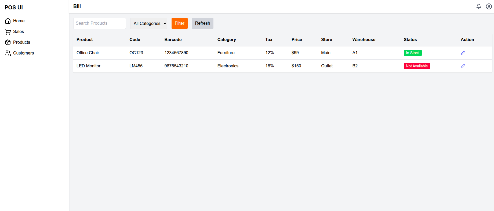

# POS UI – React App

This is a practical assessment project for the Front-End Developer Internship. It recreates a modern POS (Point of Sale) User Interface using React and Tailwind CSS, based on a provided Canva prototype.

---

## 🚀 Project Overview

The application replicates the layout, design, and interactions of a POS system UI, featuring:

- Sidebar navigation with icons
- Top navigation bar with user profile and notifications
- Search and filter bar with dropdowns
- Product listing table with:
  - Edit icon
  - Color-coded stock statuses
  - Scrollable and responsive layout
- Basic client-side filtering
- Responsive design for desktop and tablet screens

---

## 🛠️ Technology Stack Used

- **React 19** – Frontend framework
- **Vite** – Fast dev server and build tool
- **Tailwind CSS** – Utility-first styling
- **Lucide React** – Icon library
- **React Router DOM** – For routing (optional/future-proof)
- **Mock Data** – Static JSON-based mock dataset

---

## 📦 Setup & Run Instructions

### 1. Clone the Repository
```bash
git clone https://github.com/your-username/pos-ui-react.git
cd pos-ui-react



